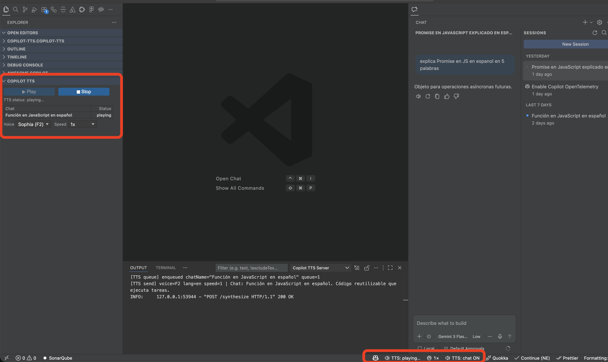

# Copilot TTS

  

A VS Code extension that reads GitHub Copilot Chat responses aloud using a local TTS server.

Supports macOS and Windows 11.

## Quick Start

1. Run `Copilot TTS: Initialize Copilot TTS` once.
2. Turn on TTS Chat Mode from the status bar or the `Copilot TTS: Toggle TTS Chat Mode` command.
3. Use normal Copilot Chat.
4. When Copilot finishes a response, it reads the latest assistant reply aloud.

## Features

| Feature                       | How to use                                                                                |
| ----------------------------- | ----------------------------------------------------------------------------------------- |
| Auto-read normal Copilot chat | Initialize Copilot TTS, turn on TTS Chat Mode, then use chat normally                     |
| Replay last spoken response   | Click **Play**, run `copilot-tts.playLast`, or use `Ctrl+6` on Windows and macOS          |
| Stop playback                 | Click **Stop**, run `copilot-tts.stopReading`, or use `Ctrl+Shift+6` on Windows and macOS |
| Change voice                  | Voice dropdown in the panel                                                               |
| Change speed                  | Speed dropdown in the panel or status bar                                                 |

## Commands

- Initialize Copilot TTS
- Toggle TTS Chat Mode
- Play Last Chat Response
- Stop Reading
- Start TTS Server
- Stop TTS Server
- Clean Local TTS Data
- Toggle Verbose Logging
- Show TTS Server Status
- Set TTS Speed

## Configuration

All settings live under `copilot-tts.*`.

| Setting            | Default     | Description                                                                                                                                          |
| ------------------ | ----------- | ---------------------------------------------------------------------------------------------------------------------------------------------------- |
| `pythonPath`       | auto-detect | Optional Python executable override used to run the local TTS server and hook runner. Leave empty to use the managed runtime fallback automatically. |
| `port`             | `8765`      | Local TTS server port                                                                                                                                |
| `voice`            | `M1`        | Voice preset used for synthesis                                                                                                                      |
| `language`         | `en`        | Synthesis language                                                                                                                                   |
| `speed`            | `1`         | Playback speed                                                                                                                                       |
| `debug`            | `false`     | Enable verbose logging in the `Copilot TTS Server` output channel. You can also use the Toggle Verbose Logging command.                              |
| `readCodeBlocks`   | `false`     | Read fenced code blocks aloud. When `false` (default) code blocks are silently skipped.                                                              |
| `autoRouteAllChat` | `false`     | Legacy migration setting used only as a default for restoring chat mode                                                                              |

### Voices

| ID  | Name    |
| --- | ------- |
| F1  | Emma    |
| F2  | Sophia  |
| F3  | Grace   |
| F4  | Luna    |
| M1  | Adam    |
| M2  | Brian   |
| M3  | Charlie |
| M4  | Daniel  |

### Supported languages

`en` `ko` `ja` `fr` `de` `es` `ru` `uk` `pl` `pt` `it` `nl` `ar` `hi` `tr` `sv` `da` `fi` `cs` `hu` `ro` `bg` `hr` `sk` `sl` `lt` `lv` `et` `el` `id` `vi`

## How TTS playback works

Responses are played one at a time. If a new response arrives while audio is already playing it is appended to the queue and played automatically when the current item finishes — nothing is interrupted. The panel shows each queued item with its chat name and a **playing** / **queued** status.

When you switch to a different chat session the Play button replays that session's last response. Spoken text is cached for the 50 most recently active sessions and survives extension restarts.

When multiple VS Code windows are open, only one window plays audio at a time. The window whose workspace triggered the response always plays it.

## Troubleshooting

**Play says there is no recent response**

The extension replays the last spoken response from its local replay cache. If this is empty, make sure the hook actually fired and inspect the `Copilot TTS Server` output channel.

**Auto-read does not work in normal chat**

Run `Copilot TTS: Initialize Copilot TTS` first, then enable TTS Chat Mode. Normal chat auto-read depends on the Stop hook firing — `Initialize Copilot TTS` registers the hook file and enables the required VS Code setting `chat.useHooks`. If that setting is disabled (for example by a workspace `settings.json`), the hook will never fire regardless of TTS Chat Mode being on.

**Server fails to start**

Run `Copilot TTS: Initialize Copilot TTS` again and inspect the `Copilot TTS Server` output channel.

**I want to remove everything before uninstalling**

Run `Copilot TTS: Clean Local TTS Data` before uninstalling. VS Code does not give this extension a reliable uninstall hook, so local cleanup must be triggered explicitly.

## License

MIT
